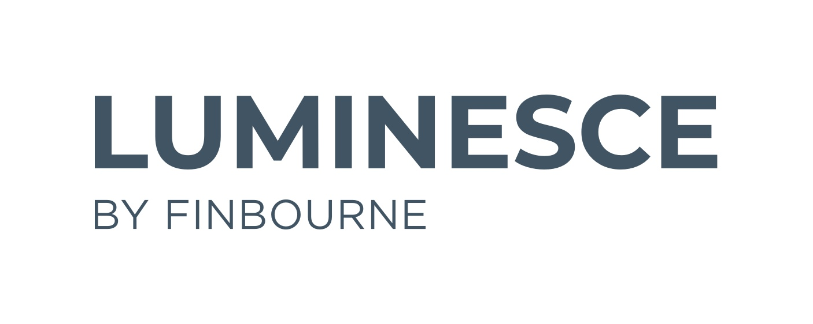

# luminesce-examples (WIP)

This repo contains reference examples for Luminence.

This project is a WIP.



| branch | status |
| --- | --- |
| `master` | [](https://github.com/finbourne/luminesce-examples/actions/workflows/build-and-test.yml)|
| `master` | [](https://github.com/finbourne/luminesce-examples/actions/workflows/daily-build.yml)|

## Run using Docker 

You can run with docker as follows.

Build the image:

```
docker build . -t luminesce-examples-runner
```

Run a container by passing auth credentials as environment variables:

```
docker run \
-e FBN_LUSID_API_URL=<API_URL> \
-e FBN_PASSWORD=<PASSWORD> \
-e FBN_APP_NAME=<APP_NAME> \
-e FBN_USERNAME=<USERNAME> \
-e FBN_CLIENT_SECRET=<CLIENT_SECRET> \
-e FBN_CLIENT_ID=<CLIENT_ID> \
-e FBN_TOKEN_URL=<TOKEN_URL> \
-e FBN_DRIVE_API_URL=<DRIVE_URL> \
-e FBN_LUMI_API_URL=<LUMI_URL> \
luminesce-examples-runner -start_dir=examples/drive
```

## Running locally

You can run one or more of these examples locally by using the `--secrets` and `--start_dir` parameters.

For example, to run the Drive examples only:

```
python runner/run.py --secrets=secrets/secrets.json --start_dir=examples/drive
```

You can also choose to keep the sample Drive files created by the runner:

```
python runner/run.py --secrets=secrets/secrets.json --start_dir=examples/drive --keepfiles
```

## List of examples

> 💡 The files in a directory are numbered if they need to be run in order 💡

**[File orchestration](<docs/File orchestration.ipynb>)**
* [Step 1: Files for testing](examples/file-orchestration/1-files-for-testing.sql)
* [Step 2: Create error file](examples/file-orchestration/2-create-error-file.sql)
* [Step 3: Create logger view](examples/file-orchestration/3-create-logger-view.sql)
* [Step 4: Create file orchestration view](examples/file-orchestration/4-create-file-orchestration-view.sql)
* [Step 5: Run file load](examples/file-orchestration/5-run-file-load.sql)

**[Drive](<docs/Drive.ipynb>)**
* [Create and move file in drive](examples/drive/create-and-move-file-in-drive.sql)
* [Create log file on error](examples/drive/create-log-file-on-error.sql)
* [Read a file from drive](examples/drive/read-a-file-from-drive.sql)
* [Read an excel file from drive](examples/drive/read-an-excel-file-from-drive.sql)
* [Save data into drive](examples/drive/save-data-into-drive.sql)
* [Unformatted string to table](examples/drive/unformatted-string-to-table.sql)

**[Pdf generation](<docs/Pdf generation.ipynb>)**
* [Step 1: Load data from drive](examples/drive/pdf-generation/1-load-data-from-drive.sql)
* [Step 2: Generate pdf](examples/drive/pdf-generation/2-generate-pdf.sql)

**[Horizon](<docs/Horizon.ipynb>)**
* [Query company data from gleif](examples/horizon/query-company-data-from-gleif.sql)

**[Run a reconciliation](<docs/Run a reconciliation.ipynb>)**
* [Step 1: Create transaction portfolio](examples/lusid/run-a-reconciliation/1-create-transaction-portfolio.sql)
* [Step 2: Create instruments](examples/lusid/run-a-reconciliation/2-create-instruments.sql)
* [Step 3: Create holdings](examples/lusid/run-a-reconciliation/3-create-holdings.sql)
* [Step 4: Create reconciliation view](examples/lusid/run-a-reconciliation/4-create-reconciliation-view.sql)
* [Step 5: Run recon with notifications](examples/lusid/run-a-reconciliation/5-run-recon-with-notifications.sql)

**[Corporate actions source](<docs/Corporate actions source.ipynb>)**
* [Create corporate action source](examples/lusid/corporate-actions-source/create-corporate-action-source.sql)
* [Read corporate action source](examples/lusid/corporate-actions-source/read-corporate-action-source.sql)

**[Portfolios](<docs/Portfolios.ipynb>)**
* [Create transaction portfolio](examples/lusid/portfolios/create-transaction-portfolio.sql)

**[Quotes](<docs/Quotes.ipynb>)**
* [Upload fx quotes](examples/lusid/quotes/upload-fx-quotes.sql)

**[Delete entities](<docs/Delete entities.ipynb>)**
* [Step 1: Delete quotes](examples/lusid/delete-entities/1-delete-quotes.sql)
* [Step 2: Delete instruments](examples/lusid/delete-entities/2-delete-instruments.sql)
* [Step 3: Delete portfolios](examples/lusid/delete-entities/3-delete-portfolios.sql)
* [Step 4: Delete properties](examples/lusid/delete-entities/4-delete-properties.sql)
* [Step 5: Delete coa](examples/lusid/delete-entities/5-delete-coa.sql)
* [Step 6: Delete gl profiles](examples/lusid/delete-entities/6-delete-gl-profiles.sql)

**[Properties](<docs/Properties.ipynb>)**
* [Create instrument properties](examples/lusid/properties/create-instrument-properties.sql)
* [Create properties from csv](examples/lusid/properties/create-properties-from-csv.sql)

**[Relationships](<docs/Relationships.ipynb>)**
* [Step 1: Create properties](examples/lusid/relationships/1-create-properties.sql)
* [Step 2: Upsert instrument properties](examples/lusid/relationships/2-upsert-instrument-properties.sql)
* [Step 3: Create legal entities](examples/lusid/relationships/3-create-legal-entities.sql)
* [Step 4: Create portfolios](examples/lusid/relationships/4-create-portfolios.sql)
* [Step 5: Assign lei to portfolio](examples/lusid/relationships/5-assign-lei-to-portfolio.sql)
* [Step 6: Create relationship definition](examples/lusid/relationships/6-create-relationship-definition.sql)
* [Step 7: Call back custodians](examples/lusid/relationships/7-call-back-custodians.sql)

**[Run a recon holdings in different scopes](<docs/Run a recon holdings in different scopes.ipynb>)**
* [Step 1: Create transaction portfolios in two scopes](examples/lusid/run-a-recon-holdings-in-different-scopes/1-create-transaction-portfolios-in-two-scopes.sql)
* [Step 2: Create instruments](examples/lusid/run-a-recon-holdings-in-different-scopes/2-create-instruments.sql)
* [Step 3: Upload abor transactions](examples/lusid/run-a-recon-holdings-in-different-scopes/3-upload-abor-transactions.sql)
* [Step 4: Upload ibor holdings](examples/lusid/run-a-recon-holdings-in-different-scopes/4-upload-ibor-holdings.sql)
* [Step 5: Create reconciliation view](examples/lusid/run-a-recon-holdings-in-different-scopes/5-create-reconciliation-view.sql)
* [Step 6: Run recon workflow](examples/lusid/run-a-recon-holdings-in-different-scopes/6-run-recon-workflow.sql)
* [Step 7: Run recon with generic reconciliation provider](examples/lusid/run-a-recon-holdings-in-different-scopes/7-run-recon-with-generic-reconciliation-provider.sql)

**[Transactions](<docs/Transactions.ipynb>)**
* [Upload transactions from csv](examples/lusid/transactions/upload-transactions-from-csv.sql)
* [Upload transactions from excel](examples/lusid/transactions/upload-transactions-from-excel.sql)
* [Upload transactions from txt](examples/lusid/transactions/upload-transactions-from-txt.sql)
* [Upload transactions from xml](examples/lusid/transactions/upload-transactions-from-xml.sql)

**[Instruments](<docs/Instruments.ipynb>)**
* [Query instruments](examples/lusid/instruments/query-instruments.sql)
* [Set properties from csv](examples/lusid/instruments/set-properties-from-csv.sql)
* [Upload bond instruments](examples/lusid/instruments/upload-bond-instruments.sql)
* [Upload equity instruments](examples/lusid/instruments/upload-equity-instruments.sql)
* [Upload future instruments](examples/lusid/instruments/upload-future-instruments.sql)
* [Upload fx forward](examples/lusid/instruments/upload-fx-forward.sql)
* [Upload simple instruments](examples/lusid/instruments/upload-simple-instruments.sql)
* [Upload term deposit instruments](examples/lusid/instruments/upload-term-deposit-instruments.sql)

**[Complex bonds](<docs/Complex bonds.ipynb>)**
* [Step 01: Fixed schedule view](examples/lusid/instruments/complex-bonds/01-fixed-schedule-view.sql)
* [Step 02: Step schedule view](examples/lusid/instruments/complex-bonds/02-step-schedule-view.sql)
* [Step 03: Upload short front sinking complex bond insturments](examples/lusid/instruments/complex-bonds/03-upload-short-front-sinking-complex-bond-insturments.sql)
* [Step 1: Fixed schedule view](examples/lusid/instruments/complex-bonds/1-fixed-schedule-view.sql)
* [Step 2: Step schedule view](examples/lusid/instruments/complex-bonds/2-step-schedule-view.sql)
* [Step 3: Upload short front sinking complex bond insturments](examples/lusid/instruments/complex-bonds/3-upload-short-front-sinking-complex-bond-insturments.sql)

**[Holdings](<docs/Holdings.ipynb>)**
* [Step 1: Create instruments](examples/lusid/holdings/1-create-instruments.sql)
* [Step 2: Create and inline txn property](examples/lusid/holdings/2-create-and-inline-txn-property.sql)
* [Step 3: Create transaction portfolio](examples/lusid/holdings/3-create-transaction-portfolio.sql)
* [Step 4: Adjust holdings](examples/lusid/holdings/4-adjust-holdings.sql)
* [Step 5: Cancel holdings](examples/lusid/holdings/5-cancel-holdings.sql)
* [Step 6: Set holdings](examples/lusid/holdings/6-set-holdings.sql)
* [Step 7: Call holdings](examples/lusid/holdings/7-call-holdings.sql)

**[Reference portfolios](<docs/Reference portfolios.ipynb>)**
* [Step 1: Upload instruments](examples/lusid/reference-portfolios/1-upload-instruments.sql)
* [Step 2: Create reference portfolio](examples/lusid/reference-portfolios/2-create-reference-portfolio.sql)
* [Step 3: Upload constituents](examples/lusid/reference-portfolios/3-upload-constituents.sql)

**[Run valuation](<docs/Run valuation.ipynb>)**
* [Step 1: Create instruments](examples/lusid/run-valuation/1-create-instruments.sql)
* [Step 2: Create portfolio](examples/lusid/run-valuation/2-create-portfolio.sql)
* [Step 3: Upload quotes](examples/lusid/run-valuation/3-upload-quotes.sql)
* [Step 4: Upload transactions](examples/lusid/run-valuation/4-upload-transactions.sql)
* [Step 5: Run simple valuation](examples/lusid/run-valuation/5-run-simple-valuation.sql)
* [Step 6: Upload external valuations](examples/lusid/run-valuation/6-upload-external-valuations.sql)
* [Step 7: Run valuation with srs](examples/lusid/run-valuation/7-run-valuation-with-srs.sql)

**[Abor](<docs/Abor.ipynb>)**
* [Step 01: Create a portfolio](examples/lusid/abor/01-create-a-portfolio.sql)
* [Step 02: Create equity instruments](examples/lusid/abor/02-create-equity-instruments.sql)
* [Step 03: Create bond instruments](examples/lusid/abor/03-create-bond-instruments.sql)
* [Step 04: Create instrument properties](examples/lusid/abor/04-create-instrument-properties.sql)
* [Step 05: Assign properties to instrument](examples/lusid/abor/05-assign-properties-to-instrument.sql)
* [Step 06: Create transactions](examples/lusid/abor/06-create-transactions.sql)
* [Step 07: Upload instrument prices](examples/lusid/abor/07-upload-instrument-prices.sql)
* [Step 08: Upload fx rates](examples/lusid/abor/08-upload-fx-rates.sql)
* [Step 09: Create cash transactions](examples/lusid/abor/09-create-cash-transactions.sql)
* [Step 10: Add transaction properties](examples/lusid/abor/10-add-transaction-properties.sql)
* [Step 10: Create a chart of accounts](examples/lusid/abor/10-create-a-chart-of-accounts.sql)
* [Step 11: Add accounts to chart of accounts](examples/lusid/abor/11-add-accounts-to-chart-of-accounts.sql)
* [Step 12: Create posting module](examples/lusid/abor/12-create-posting-module.sql)
* [Step 13: Create posting rules](examples/lusid/abor/13-create-posting-rules.sql)
* [Step 14: Create an abor configuration](examples/lusid/abor/14-create-an-abor-configuration.sql)
* [Step 15: Create abor](examples/lusid/abor/15-create-abor.sql)
* [Step 16: Create journal entry lines](examples/lusid/abor/16-create-journal-entry-lines.sql)
* [Step 17: Create general ledger profile](examples/lusid/abor/17-create-general-ledger-profile.sql)
* [Step 18: Create general ledger profile mappings](examples/lusid/abor/18-create-general-ledger-profile-mappings.sql)
* [Step 19: Generate trial balance](examples/lusid/abor/19-generate-trial-balance.sql)
* [Step 20: Run a trial balance check](examples/lusid/abor/20-run-a-trial-balance-check.sql)

**[Returns](<docs/Returns.ipynb>)**
* [Step 1: Create transaction portfolio](examples/lusid/returns/1-create-transaction-portfolio.sql)
* [Step 2: Upload portfolio returns](examples/lusid/returns/2-upload-portfolio-returns.sql)
* [Step 3: Calculate aggregate returns](examples/lusid/returns/3-calculate-aggregate-returns.sql)

**[Check for duplicates](<docs/Check for duplicates.ipynb>)**
* [Step 0: Load instruments into lusid](examples/data-qc-checks/check-for-duplicates/0-load-instruments-into-lusid.sql)
* [Step 1: Create duplicate check view](examples/data-qc-checks/check-for-duplicates/1-create-duplicate-check-view.sql)

**[Reconcile instruments](<docs/Reconcile instruments.ipynb>)**
* [Step 1: Create instrument properties](examples/data-qc-checks/reconcile-instruments/1-create-instrument-properties.sql)
* [Step 2: Setup instrument with properties](examples/data-qc-checks/reconcile-instruments/2-setup-instrument-with-properties.sql)
* [Step 3: Load instruments into source a](examples/data-qc-checks/reconcile-instruments/3-load-instruments-into-source-a.sql)
* [Step 4: Load instruments into source b](examples/data-qc-checks/reconcile-instruments/4-load-instruments-into-source-b.sql)
* [Step 5: Run reconciliation](examples/data-qc-checks/reconcile-instruments/5-run-reconciliation.sql)

**[Check for price outliers](<docs/Check for price outliers.ipynb>)**
* [Step 0: Create instrument property definitions](examples/data-qc-checks/check-for-price-outliers/0-create-instrument-property-definitions.sql)
* [Step 1: Setup instruments with properties](examples/data-qc-checks/check-for-price-outliers/1-setup-instruments-with-properties.sql)
* [Step 2: Upload quotes](examples/data-qc-checks/check-for-price-outliers/2-upload-quotes.sql)
* [Step 3: Create iqr checker view](examples/data-qc-checks/check-for-price-outliers/3-create-iqr-checker-view.sql)
* [Step 4: Create price outlier view](examples/data-qc-checks/check-for-price-outliers/4-create-price-outlier-view.sql)
* [Step 5: Run price outlier view](examples/data-qc-checks/check-for-price-outliers/5-run-price-outlier-view.sql)

**[Cross sectional outliers](<docs/Cross sectional outliers.ipynb>)**
* [Step 0: Create properties](examples/data-qc-checks/cross-sectional-outliers/0-create-properties.sql)
* [Step 1: Upload instrumets](examples/data-qc-checks/cross-sectional-outliers/1-upload-instrumets.sql)
* [Step 2: Create cross sectional outlier view](examples/data-qc-checks/cross-sectional-outliers/2-create-cross-sectional-outlier-view.sql)
* [Step 3: Run cross sectional outlier view](examples/data-qc-checks/cross-sectional-outliers/3-run-cross-sectional-outlier-view.sql)

**[Check for missing instrument fields](<docs/Check for missing instrument fields.ipynb>)**
* [Step 1: Create instrument properties](examples/data-qc-checks/check-for-missing-instrument-fields/1-create-instrument-properties.sql)
* [Step 2: Load instruments into lusid](examples/data-qc-checks/check-for-missing-instrument-fields/2-load-instruments-into-lusid.sql)
* [Step 3: Check for missing instrument fields](examples/data-qc-checks/check-for-missing-instrument-fields/3-check-for-missing-instrument-fields.sql)

**[Basic data integrity](<docs/Basic data integrity.ipynb>)**
* [Basic data integrity](examples/data-qc-checks/basic-data-integrity/basic-data-integrity.sql)

**[System](<docs/System.ipynb>)**
* [Append inline properties to system configuration](examples/system/append-inline-properties-to-system-configuration.sql)
* [Error handling details to file](examples/system/error-handling-details-to-file.sql)
* [Iif and case when statements](examples/system/iif-and-case-when-statements.sql)
* [Load one cell of data to table by delimiters](examples/system/load-one-cell-of-data-to-table-by-delimiters.sql)
* [Pivot data](examples/system/pivot-data.sql)
* [Random prices generator](examples/system/random-prices-generator.sql)
* [To utc and iso](examples/system/to-utc-and-iso.sql)
* [Using datetimes](examples/system/using-datetimes.sql)

**[For loops with cross apply](<docs/For loops with cross apply.ipynb>)**
* [Step 1: Create instrument upsert view](examples/system/for-loops-with-cross-apply/1-create-instrument-upsert-view.sql)
* [Step 2: Loop over csv file](examples/system/for-loops-with-cross-apply/2-loop-over-csv-file.sql)

**[Statistical functions](<docs/Statistical functions.ipynb>)**
* [Fuzzy search two files](examples/statistical-functions/fuzzy-search-two-files.sql)

**[Insights](<docs/Insights.ipynb>)**
* [Count of requests per lusid method](examples/insights/count-of-requests-per-lusid-method.sql)

**[View management](<docs/View management.ipynb>)**
* [Step 1: Create view with no params](examples/view-management/1-create-view-with-no-params.sql)
* [Step 2: Fetch sql used to create view](examples/view-management/2-fetch-sql-used-to-create-view.sql)
* [Step 3: Current content of view](examples/view-management/3-current-content-of-view.sql)
* [Step 4: Show view history](examples/view-management/4-show-view-history.sql)
* [Step 5: Show view dependencies](examples/view-management/5-show-view-dependencies.sql)
* [Step 6: Show dependencies on view](examples/view-management/6-show-dependencies-on-view.sql)
* [Step 7: Delete a view](examples/view-management/7-delete-a-view.sql)
* [Step 8: Run table of query strings](examples/view-management/8-run-table-of-query-strings.sql)


## Automated testing

We run automated tests on the SQL files in this project via GitHub Actions. The configurtion for these tests live in the `.github/workflows`
directory.

Many of our tests require setup data. To create this data, there is a process where the testing <b>runner</b>
will search for a `_data` directory wherever it finds `.sql` files. Then, two things happen:

1. If there are data files in the `_data` directory, the runner will upload these to a `luminesce-examples` folder in
LUSID Drive
2. If there is a `setup.py` file in this directory, the runner will run the `setup.py` file. We use this `setup.py`
file to configure recipes and other configurations we don't want to setup via Luminesce.

Sample structure below:

```
upload_equity_instruments.sql
upload_bond_instruments.sql
_data
    eq_instruments.csv
    instruments.txt
    setup.py
```


| :warning: This file is generated, any direct edits will be lost. For instructions on how to generate the file, see [docgen](docgen). |
| --- |
